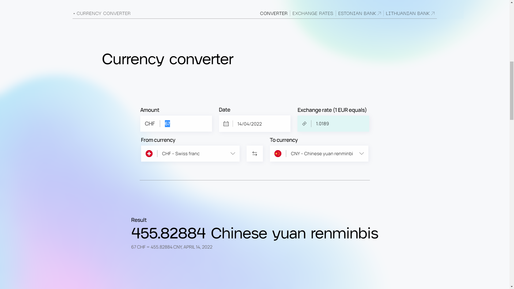

# Currency converter
_PHP Composer based project_

## Table of Contents
* [Steps to reproduce](#steps-to-reproduce-)
* [How to add new source](#how-to-add-new-source-)
* [Packages/dependencies used](#packagesdependencies-used-)
* [TODOs](#todos-)
* [License](#license-)
* [Credits](#credits-)

## Steps to reproduce 
__You need:__ PHP 8.0, Composer, NodeJS, NPM, Docker (Must have for Storage)

__Recommended:__ RedisInsight, PHPStorm, Visual Studio Code

### To reproduce you need firstly to download or clone the code:

`git clone https://github.com/e3stpavel/crnc.git`

### First install the Redis extension for PHP:
1. Download [PHPRedis]('https://windows.php.net/downloads/pecl/releases/redis/5.3.7rc2/').
2. Copy the `php_redis.dll` to `path/to/your/php/ext/`
3. Declare it in `php.ini` file by adding the following line `extension=php_redis.dll`

### When you have all the source code downloaded and redis installed you can download the dependencies and packages.
* `composer install`
* `npm install`

### Create environment file
Next step is to create `.env` file with environment values. Simply copy `.env.example` and rename to `.env`
You can change values to change Redis connection or change app behaviour (debug or production)

#### __TO RUN APP IN DEBUG MODE:__
* Put `APP_DEBUG=true` in `.env` file
* Run `composer serve` to run PHP server
* Run `composer vite` or `npm run dev` to run Vite dev server
* Run `docker-compose up -d` to run Redis
* Open `localhost:8080` in your favourite browser
* __CONGRATS!__ You're running now currency calculator in your browser in development mode

#### __TO RUN APP IN PRODUCTION MODE:__
* Put `APP_DEBUG=false` in `.env` file
* Run `npm run build` to generate static JavaScript files and `manifest.json`
* Run `composer serve` to run PHP server
* Run `docker-compose up -d` to run Redis
* Open `localhost:8080` in your favourite browser
* __CONGRATS!__ You're running now currency calculator in your browser in production mode

## How to add new source 
The main task was to make adding new API source as easy as possible and here's what I did to achieve this:
* The main _abstract_ class is called `Consumer` and is situated in `App/Model/`
* To add the source you should create a new subclass which implements abstract class `Consumer`
* Your class must override the property `protected string $uri` by assigning the appropriate link in __sprintf format__ to the source and replacing the __date in Y-m-d format__ with `%s`:
  * Example: `protected string $uri = 'https://appropriate_link/date=%s';`
* Your class must implement the `get()` method where the actual API consuming logic is situated. The method must return the array.
* Also, there are some utility methods such as `explode` which return the array split by `\n` separator
* Also, there's some getters for you to use:
  * `getDate()` returns date in Y-m-d format as a string
  * `getUri()` returns the uri in sprintf string format
  * `getFormatUri()` returns the full formatted uri with date in it as a string
* To use your custom consumer you need to:
  * Create a new object instance: for instance `$consumer = new YourConsumer('2022-04-18');`
  * In order to get the data use your implementation of `get()` method: for example `$rates = $consumer->get();`
  * Then you can work with the data that you get
* Basically the further API consuming logic is in `Currency` model in `load()` method (using your consumer is recommended there as well)

## Packages/dependencies used 
NB! I've started from scratch. No php frameworks was used while developing this project.

### Composer packages used
* [PHPRedis]('https://windows.php.net/downloads/pecl/releases/redis/5.3.7rc2/') - using Redis as a Storage
* [RedisJson from mkorkmaz]('https://github.com/mkorkmaz/redislabs-rejson') - using Redis factory to connect to the database
* [PHPUnit]('https://github.com/sebastianbergmann/phpunit') - using it for testing
* [DotEnv]('https://github.com/vlucas/phpdotenv') - using it for storing environment variables and sensitive data
* [BladeOne]('https://github.com/EFTEC/BladeOne) - using the Blade engine as well

### NodeJS packages used
* ESLint - to quickly fix my code style
* WindiCSS - to quickly write CSS
* Vite Live Reload - to enable live reload while developing
* GSAP - to make some fancy animations
* TypeScript - just why not to use it

## TODOs 
* ~~Make the framework setup up and running~~ 
* ~~Design and implement UI~~
* ~~Make the converter work~~
* ~~Implement some flag API~~
* ~~Consume the bank's API~~
* ~~Cache the data from API to the Storage~~
* ~~Clear up the code a bit~~
* ~~Make the API consuming structure more flexible~~
* Add the lazy load to make UX more convenient
* Dockerize the app
* Make some unit test using PHPUnit
* Make some integration tests
* ~~Clear up the README a bit~~
* ~~Add production build support (read Vite Manifest)~~
* ~~Add the license~~

## License 
[MIT License](LICENSE)

## Credits 
Developed and designed by [e3stpavel]('https://github.com/e3stpavel')
